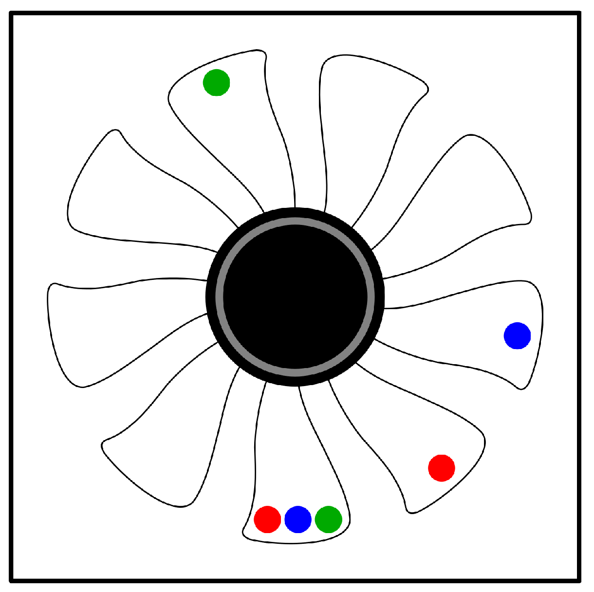

```{r}
library(ggplot2)
```

---
title: "Accelerometer Linear Regression"
author: "Spencer Gray & Michael Stinnett"
date: "2022-09-25"
output: html_document
---

## Dataset Source: https://archive.ics.uci.edu/ml/datasets/Accelerometer#

This dataset is a recording of movement in the x y and z directions in response to variously placed weights on a fan.
There are 153,000 recordings with 5 variables. There are 3 different configurations (Wconfigid) which determines the arrangement of weights on the fan blade. Pctid represents the power applied to the motor.
In summary, there are 3 setups each slowly increasing the motor power and recording the disturbance.
  
Red is configuration 1  
Blue is configuration 2  
Green is configuration 3

{width=50%}
  
Predicting variations in Z movement based off of power going to the motor (pctid).

```{r}
accelerometer <- read.csv("accelerometer.csv")
dim(accelerometer)
head(accelerometer)

mean1 <- mean(accelerometer$z)
med1 <- median(accelerometer$z)
range1 <- range(accelerometer$z)
var1 <- var(accelerometer$z)
sd1 <- sd(accelerometer$z)

print(paste('mean: ', mean1))
print(paste('median: ', med1))
print(paste('range: ', range1))
print(paste('var: ', var1))
print(paste('sd: ', sd1))

par(mfrow=c(1,3))
with(accelerometer[accelerometer$wconfid<2,], plot(pctid, z, xlab="Motor Power", main="Red Configuration"))
with(accelerometer[accelerometer$wconfid>1 & accelerometer$wconfid < 3,], plot(pctid, z,xlab="Motor Power", main="Blue Configuration"))
with(accelerometer[accelerometer$wconfid>2,], plot(pctid, z,xlab="Motor Power", main="Green Configuration"))
```

## Linear Regression Model

```{r}
set.seed(1234)
i <- sample(1:nrow(accelerometer), nrow(accelerometer)*0.8, replace = FALSE)
train <- accelerometer[i,]
test <- accelerometer[-i,]
```

### Statistical Analysis of Linear Model (1 predictor)

The relationship in the Residuals vs Fitted plot appears to show a 'linear' relationship. Moreso a line centered and parallel with the x-axis. However this can be caused by a symmetrical oscillation centered around the x-axis. We will most likely need more predictors and tweaks to provide an accurate approximation.  
The error (residuals) in the Q-Q plot appear to deviate strongly, follow the line, and then deviate again. This could be caused by the three separate configurations producing higher or lower variance. This is further revealed in the scale-location plot revealing that our z-axis variance increases as we increase our motor power. Residuals vs Leverage plot does not seem to share any substantial information on strong outliers

```{r}
lm1 <- lm(z ~ pctid, data=train)
summary(lm1)

par(mfrow=c(2,2))
plot(lm1)
```


### Statistical Analysis of Linear Model (2 predictors)

```{r}
lm2 <- lm(z ~ pctid+wconfid, data=train)
summary(lm2)

par(mfrow=c(2,2))
plot(lm2)

```

### Statistical Analysis using Other Methods

To get a more accurate estimate I am selecting one sample of tests, fan configuration 1.
Then taking the absolute value of the z movements (to remove symmetry causing net zero slope) and doing a polynomial regression.

```{r}
lm3 <- with(train[train$wconfid<2,], lm(sqrt(abs(z)) ~ pctid + I(pctid^2) + I(pctid^3) + wconfid, data = train))
summary(lm3)

par(mfrow=c(2,2))
plot(lm3)
```

As seen in both linear model 1 and linear model 2, they both got similar results. A misrepresentation of the data and a prediction that doesn't even come close to the test data. The statistical summary listed below shows a covariance less than 0.01, but with linear model 3 we got a covariance of 0.6. The first step was to separate the three different categories. For model 3 I restricted the test and training data to fan configuration 1. Then removed x-axis symmetry with abs() before using sqrt() to reduce the exponential behavior. A polynomial fit with a degree of 3 was used for best fit, compensating for any quadratic behavior.

## Statistical Summary

```{r}
pred1 <- predict(lm1, newdata = test)
cor1 <- cor(pred1, test$z)
mse1 <- mean((pred1 - test$z)^2)
rmse1 <- sqrt(mse1)

pred2 <- predict(lm2, newdata = test)
cor2 <- cor(pred2, test$z)
mse2 <- mean((pred2 - test$z)^2)
rmse2 <- sqrt(mse2)

pred3 <- with(test[test$wconfid<2,], predict(lm3, newdata = test))
cor3 <- cor(pred3, sqrt(abs(test$z)))
mse3 <- mean((pred3 - sqrt(abs(test$z)))^2)
rmse3 <- sqrt(mse3)

print(paste('correlation: ', cor1, cor2, cor3))
print(paste('mse: ', mse1, mse2, mse3))
print(paste('rmse: ', rmse1, rmse2, rmse3))
```

### Summary
The first two models included all of the different fan configurations, resulting in inconsistent results. The biggest factor that separated the third model is to categorize data properly before training a model.